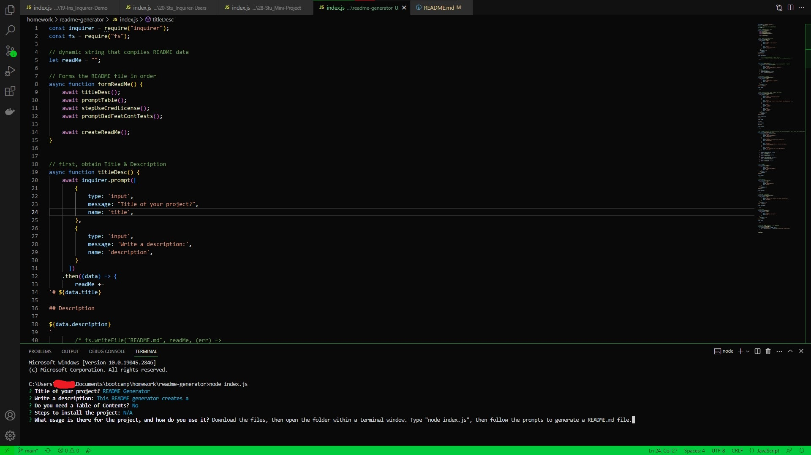

# README Generator

## Description

This README generator creates a README.md file for any project. The user runs index.js in a terminal window, then follows a list of prompts to create the file.

Node.js was used to install the inquirer.js package, which provides prompts for the user to answer. The 'fs' module reads and writes text accordingly. In addition, async/promise functions were used for two functions: seperating optional questions from required ones, and ensuring each question list activates one at a time.

## Installation

If Node.js is not already installed in your system, you can get it at <https://nodejs.org>. Once installed, download the files in the repository. The files can then be accessed/opened in a terminal window (Command Prompt for Windows, Terminal for Mac OS X and Linux).

## Usage

Open the folder containing the files via terminal window. Type "node index.js", then answer the prompts to generate a README.md file.

## Credits

Special thanks to the University of Minnesota - Twin Cities for kickstarting my coding journey.

## License

MIT License

Copyright (c) [2023] [Andrew Joo]

Permission is hereby granted, free of charge, to any person obtaining a copy
of this software and associated documentation files (the "Software"), to deal
in the Software without restriction, including without limitation the rights
to use, copy, modify, merge, publish, distribute, sublicense, and/or sell
copies of the Software, and to permit persons to whom the Software is
furnished to do so, subject to the following conditions:

The above copyright notice and this permission notice shall be included in all
copies or substantial portions of the Software.

THE SOFTWARE IS PROVIDED "AS IS", WITHOUT WARRANTY OF ANY KIND, EXPRESS OR
IMPLIED, INCLUDING BUT NOT LIMITED TO THE WARRANTIES OF MERCHANTABILITY,
FITNESS FOR A PARTICULAR PURPOSE AND NONINFRINGEMENT. IN NO EVENT SHALL THE
AUTHORS OR COPYRIGHT HOLDERS BE LIABLE FOR ANY CLAIM, DAMAGES OR OTHER
LIABILITY, WHETHER IN AN ACTION OF CONTRACT, TORT OR OTHERWISE, ARISING FROM,
OUT OF OR IN CONNECTION WITH THE SOFTWARE OR THE USE OR OTHER DEALINGS IN THE
SOFTWARE.
